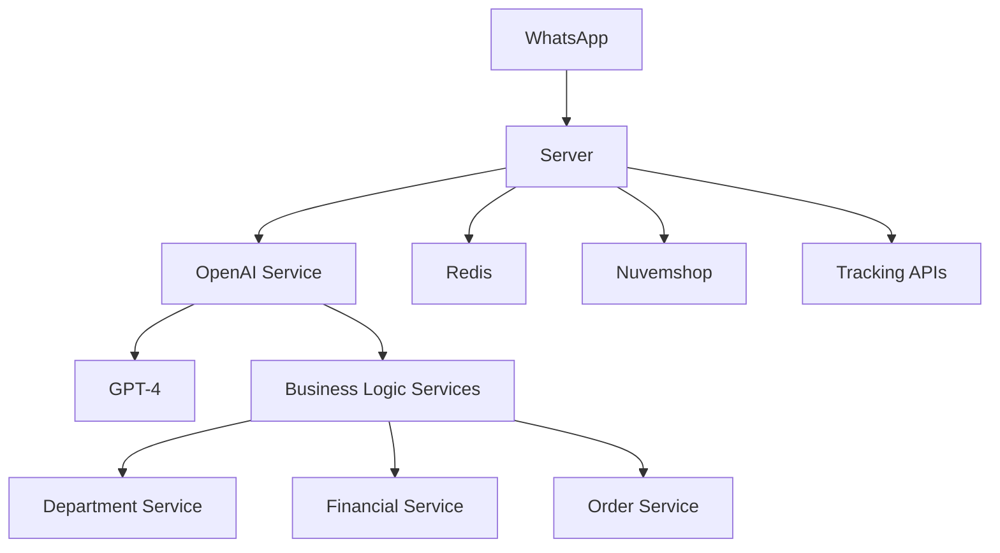

# Arquitetura do Sistema 🏗️

## Visão Geral

O sistema é construído em uma arquitetura modular baseada em serviços, com o OpenAI GPT-4 como núcleo de processamento de linguagem natural.



## 🔄 Fluxo de Dados

1. **Entrada de Mensagem**
   - Recebimento via WhatsApp Business API
   - Validação e sanitização
   - Armazenamento em Redis

2. **Processamento**
   - Análise pelo GPT-4
   - Identificação de intenção
   - Execução de funções específicas

3. **Integração**
   - Consultas à Nuvemshop
   - Verificação de rastreamento
   - Processamento de pagamentos

4. **Resposta**
   - Geração de resposta contextualizada
   - Formatação apropriada
   - Envio via WhatsApp

## 🧩 Componentes Principais

### 1. OpenAI Service (openai-service.js)

- Gerenciamento de threads
- Execução de funções
- Rate limiting
- Gestão de contexto

### 2. Business Services

- **Department Service**: Encaminhamento de casos
- **Financial Service**: Processamento financeiro
- **Order Service**: Gestão de pedidos
- **Tracking Service**: Rastreamento de entregas

### 3. Armazenamento

- Redis para cache e sessões
- Armazenamento de conversas
- Gestão de estado

### 4. Integrações

- WhatsApp Business API
- Nuvemshop API
- APIs de Rastreamento
- OpenAI API

## 📦 Estrutura de Diretórios

```src/
├── services/           # Serviços principais
│   ├── department.js   # Serviço de Departamentos
│   ├── financial.js    # Serviço Financeiro
│   ├── order.js        # Serviço de Pedidos
│   └── tracking.js     # Serviço de Rastreamento
├── tracking-system/    # Sistema de rastreamento
├── store/             # Gerenciamento de estado
├── utils/             # Utilitários
├── config/            # Configurações
└── automations/       # Automações
```

## 🔐 Segurança

### Camadas de Proteção

1. **API Gateway**
   - Rate limiting
   - Validação de tokens
   - Filtragem de IPs

2. **Aplicação**
   - Sanitização de entrada
   - Validação de dados
   - Logs seguros

3. **Dados**
   - Criptografia em trânsito
   - Criptografia em repouso
   - Backup automático

## 📊 Escalabilidade

### Horizontal

- Múltiplas instâncias
- Load balancing
- Cache distribuído

### Vertical

- Otimização de recursos
- Pooling de conexões
- Batch processing

## 🔄 Ciclo de Vida da Mensagem

1. **Recebimento**

   ```javascript
   async processMessage(messageData)
   ```

2. **Processamento**

   ```javascript
   async handleToolCalls(run, threadId)
   ```

3. **Resposta**

   ```javascript
   async sendResponse(response)
   ```

## 📈 Monitoramento

### Métricas Principais

- Tempo de resposta
- Taxa de sucesso
- Uso de recursos
- Erros e exceções

### Logs

- Nível de informação
- Nível de erro
- Auditoria
- Performance

## 🔄 Ciclo de Deploy

1. **Desenvolvimento**
   - Testes locais
   - Code review
   - Integração contínua

2. **Homologação**
   - Testes automatizados
   - Testes de integração
   - Validação de performance

3. **Produção**
   - Deploy automatizado
   - Monitoramento
   - Rollback automático
